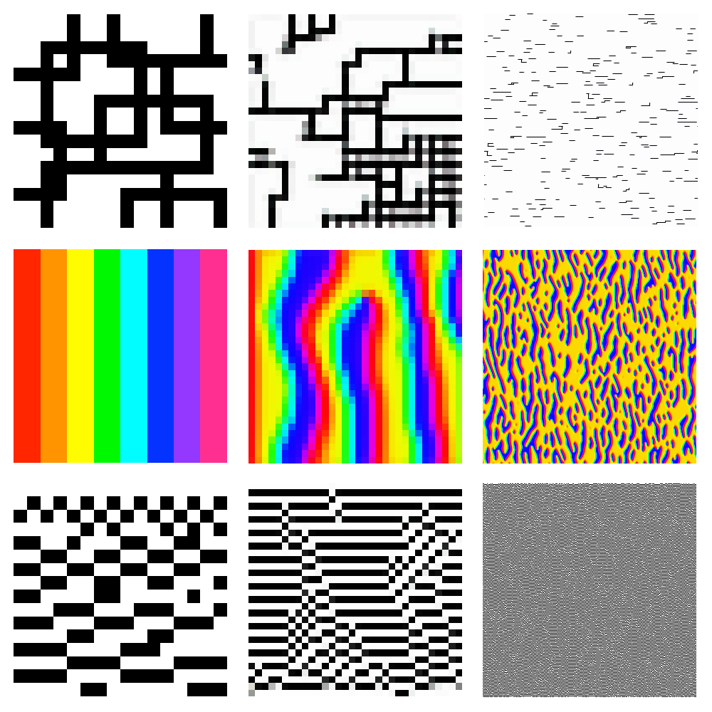

# imgen

A neural network to generate images which look similar to the input.



> Left: input. Middle: 32x32 output. Right: 300x300 output.

## How does it work?

It uses a neural network with 24 inputs and 3 outputs (and 2 hidden layers, each with 16 neurons.) Each three inputs represents the RGB colour channels of one of the neighbours of a pixel, and the 3 outputs are the RGB channels of the output pixel. During training, the network goes through each pixel of the input image and attempts to make the output equal to that pixel when the pixel's neighbours are fed in. This is done a lot of times, and once it's finished, a new image is created with a specified size for the output. Initially, each output pixel is set to a random colour. A number of times, the new image is iterated and each pixel's neighbours are fed into the trained network, and the pixel is set to the output.

## Usage

```bash
# download imgen
go get github.com/zac-garby/imgen

# get help on the flags
imgen -help

# assuming you have a file called `ref.png` and the default options are okay:
imgen
```
